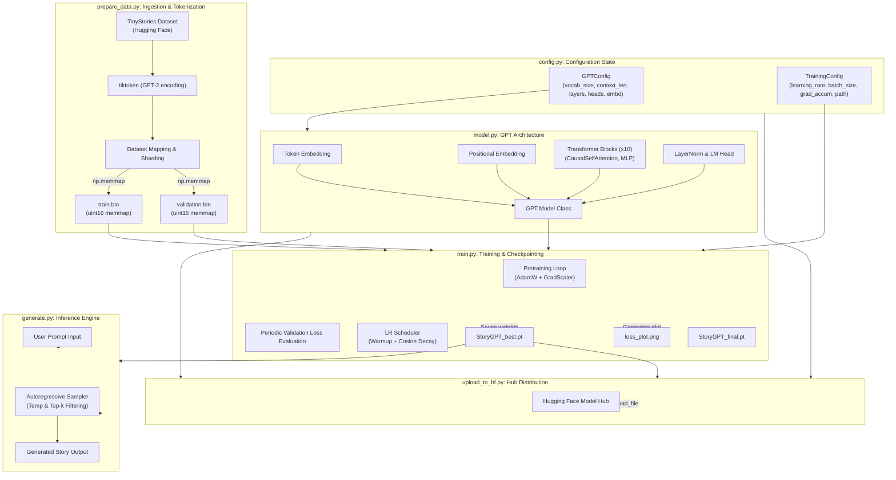

# StoryGPT — Pretraining a Small Language Model from Scratch on TinyStories

## Overview

StoryGPT is a causal decoder-only Small Language Model (SLM) trained from scratch on the TinyStories dataset. This project implements a practical pretraining pipeline using modern PyTorch features, memory-efficient data loading, mixed-precision training, and scalable training practices to produce a model capable of generating coherent short stories.

Many tutorials on building GPT-style language models stop at generating toy outputs—character-level text, simple word sequences, or incoherent stories trained on only a tiny fraction of a dataset. While these examples are useful for understanding transformer mechanics, they rarely demonstrate how to train a model capable of maintaining narrative flow and producing coherent multi-sentence outputs.

Despite its relatively small size (~57M parameters), StoryGPT learns grammatical structure, narrative progression, and short-form storytelling patterns while remaining computationally accessible enough to train on a single GPU.

---

## Technology Stack

* PyTorch
* Python
* tiktoken (GPT-2 encoding)
* Hugging Face Hub
* NumPy memmap
* Flash Attention (SDPA)

---

## Technical Architecture & Ingestion Pipeline

The pretraining of `StoryGPT` is organized into a modular, clean, and efficient pipeline.



---

## 1. The Dataset: Preparing Shards for Autoregressive Training

We train `StoryGPT` on the `roneneldan/TinyStories` dataset. TinyStories contains short stories generated with simple vocabulary and sentence structure, which makes it especially suitable for training small language models on narrative behavior rather than broad world knowledge.

Raw text, however, is too slow to load dynamically during GPU training. We build a high-performance ingestion pipeline in `prepare_data.py`.

### Tokenization Strategy

Instead of training a custom tokenizer, we adopt the standard GPT-2 byte-pair encoding (BPE) tokenizer via `tiktoken`.

- **Vocabulary Size (`vocab_size`)**: 50,257
- **End-of-Text Handling**: To teach the model where one story ends and another begins, we append the BPE end-of-text token `50256` (`<|endoftext|>`) at the end of each story text.

### Zero-Overhead Memory Mapping (`np.memmap`)

To avoid loading large token arrays into system memory, the tokenized splits are written directly to disk as contiguous binary streams of `uint16` values. Since the maximum token value is 50,256, it fits comfortably in a 16-bit integer, which reduces storage overhead and makes training input access fast and simple.

```python
dtype = np.uint16
arr = np.memmap(filename, dtype=dtype, mode='w+', shape=(arr_len,))
```

During training, `train.py` memory-maps these files in read-only mode. The training loop samples batches by reading token offsets directly from disk and moving them to the GPU only when needed.

---

## 2. Model Architecture: Causal Transformer Design

The model implementation in `model.py` defines a causal, decoder-only Transformer inspired by the GPT-2 architecture. The implementation emphasizes clarity, modularity, and efficient execution using modern PyTorch primitives.

### Hyperparameter Configuration

We configure `StoryGPT` with the following parameters:

| Hyperparameter | Value | Rationale |
| :--- | :---: | :--- |
| **Model Parameters** | **approximately 57M** | A compact model size suitable for learning short-form stories |
| **Embedding Dimension (`n_embd`)** | 512 | Representation capacity of token features |
| **Attention Heads (`n_head`)** | 8 | Each head has dimension `512 / 8 = 64` |
| **Layers (`n_layer`)** | 10 | Depth to capture narrative structure |
| **Context Length (`context_length`)** | 256 | Covers most TinyStories sequences efficiently |
| **Dropout** | 0.1 | Regularization to reduce overfitting |
| **Bias** | True | Used in linear layers and layer norms for GPT-2-style consistency |

### Scaled Dot Product Attention (SDPA)

The attention implementation utilizes PyTorch's native `scaled_dot_product_attention` API when available:

```python
if hasattr(F, "scaled_dot_product_attention"):
    attention_output = F.scaled_dot_product_attention(
        queries,
        keys,
        values,
        dropout_p=self.dropout if self.training else 0.0,
        is_causal=True,
    )
```

This API allows PyTorch to automatically dispatch to the most efficient attention backend supported by the current hardware and software environment. Depending on the GPU architecture and PyTorch version, execution may utilize optimized kernels such as Flash Attention, Memory-Efficient Attention, or the standard mathematical implementation.

When SDPA is unavailable, the model falls back to a manually implemented masked attention mechanism using causal masking.

This approach provides both portability and performance while keeping the implementation simple and easy to study.

---

## 3. Pretraining Methodology & Training Dynamics

Pretraining from scratch is sensitive to training configuration, so the training loop is designed to stay stable and reproducible.

### Effective Batch Size & Gradient Accumulation

We configure a physical batch size of 64 sequences per micro-step. To simulate a larger batch size of 256 sequences without running out of GPU memory, we accumulate gradients over 4 steps before applying an optimizer update.

- **Effective Batch Size**: `64 × 4 = 256` sequences
- **Tokens per Update**: `256 × 256 = 65,536` tokens
- **Pretraining Budget**: 50,000 forward/backward iterations with gradient accumulation applied every four iterations, resulting in approximately **3.28 billion tokens** processed across training

### Optimizer & Learning Rate Scheduling

We use **AdamW** with a weight decay of `0.1` and gradient clipping set to `1.0` to stabilize training.

The learning rate follows a custom schedule using PyTorch's `SequentialLR`:

1. **Linear Warmup**: Over the first 1,000 steps, the learning rate increases gradually from a small starting factor to the peak value.
2. **Cosine Annealing Decay**: After warmup, the learning rate decays smoothly down to a minimum value of `3e-5`.

```python
scheduler_warmup = LinearLR(optimizer, start_factor=0.001, total_iters=warmup_updates)
scheduler_decay = CosineAnnealingLR(optimizer, T_max=total_updates - warmup_updates, eta_min=min_lr)
scheduler = SequentialLR(optimizer, schedulers=[scheduler_warmup, scheduler_decay], milestones=[warmup_updates])
```

### Mixed-Precision Training

To maximize GPU utilization, `StoryGPT` employs automatic mixed-precision training.

The training script automatically selects:

- **bfloat16** on hardware that supports it, such as NVIDIA A100 GPUs
- **float16** on older CUDA devices
- **float32** on CPU environments

When float16 is used, PyTorch's `GradScaler` is enabled to prevent gradient underflow. When bfloat16 is available, scaling is unnecessary because bfloat16 retains the dynamic range of float32 while providing significant memory and throughput benefits.

### Validation & Checkpointing

Validation loss is evaluated periodically during training, and the best-performing checkpoint is saved automatically. This makes it easy to keep the model state that generalizes best, rather than relying only on the final training step.

---

## 4. Results & Performance

`StoryGPT` was pretrained for 50,000 steps. The validation loss was evaluated every 500 steps, and the checkpoint with the lowest validation loss was saved as the production candidate.

### Training Dynamics

The model shows stable optimization throughout training, with validation loss closely tracking training loss. The absence of large divergence suggests that the chosen regularization and learning-rate schedule are effective for this setup.

Example progression:

```text
Step 500:   train loss 5.2104, val loss 5.1983
Step 1000:  train loss 3.4215, val loss 3.4092
Step 5000:  train loss 2.1560, val loss 2.1601
Step 10000: train loss 1.7610, val loss 1.7690
Step 25000: train loss 1.3504, val loss 1.3683
Step 50000: train loss 1.0924, val loss 1.1218
```

### Observed Training Performance

- **Memory Footprint**: approximately 4–5 GB VRAM
- **Throughput**: approximately 13K–14K tokens/sec
- **Total Training Duration**: approximately 3–4 hours

If you want to report an exact perplexity value, you can compute it from the validation loss using:

```python
import math
perplexity = math.exp(val_loss)
```

---

## 5. Generated Story Examples

### Example 1

**Prompt**

Once upon a time there was a king.

**Generated Output**

Once upon a time there was a king. He lived in a castle and never wanted to get out. One day, he heard a noise. He looked around and saw a little girl. She was shaking with fear. The king asked her why she was shaking. The girl said she was scared of the loud noise. The king wanted to help her, so he offered her a hand. He said, "Don't be scared. It's just a noise. Just be brave and be brave". The little girl felt much braver and tried to join the king. He held her hand and said, "Let's go together". He took her hand and they went outside. The little girl was so happy. She smiled and hugged the king. They had a wonderful time. From that day forward, they were the greatest of friends.

### Example 2

**Prompt**

A little rabbit found a mysterious box.

**Generated Output**

A little rabbit found a mysterious box under a bush. The rabbit was very curious. He wanted to know what was in the box. He hopped closer and looked at it. The rabbit said, "I can't open it, but it might be a surprise!" The rabbit tried to open the box, but it was too hard. He asked his friend, a small mouse, to help him. "Can you help me open the box?" the rabbit said. The mouse tried and tried, but he could not open the box. The rabbit and the mouse decided to work together. They jumped and jumped and shook the box. They pulled and pushed until the box opened. Inside, there were many colorful balls inside. The rabbit and the mouse had so much fun playing with the balls. They played together and became the best of friends.

---

## 6. Model Distribution & Portability

To make sharing easy, `upload_to_hf.py` packages the code definition and trained model weights, uploading them directly to the Hugging Face Hub.

### Publishing to Hugging Face

Running the upload command creates the model repository on the Hub and generates a structured model card:

```bash
python upload_to_hf.py --repo_id "username/StoryGPT" --token "hf_token"
```

### Loading the Model Programmatically

By packaging the model files inside the Hugging Face repository, anyone can run inference programmatically without cloning the full Git repository manually.

```python
import os
import sys
import torch
import tiktoken
from huggingface_hub import hf_hub_download

# Define repository and destination
repo_id = "your-username/StoryGPT"
local_dir = "./StoryGPT_model"
os.makedirs(local_dir, exist_ok=True)

# 1. Download model definition, config, and weights
hf_hub_download(repo_id=repo_id, filename="model.py", local_dir=local_dir)
hf_hub_download(repo_id=repo_id, filename="config.py", local_dir=local_dir)
checkpoint_path = hf_hub_download(repo_id=repo_id, filename="checkpoints/StoryGPT_best.pt", local_dir=local_dir)

# 2. Dynamically import model definition from downloaded directory
sys.path.append(local_dir)
from model import GPT

# 3. Load model weights
device = "cuda" if torch.cuda.is_available() else "cpu"
checkpoint = torch.load(checkpoint_path, map_location=device, weights_only=False)
model = GPT(checkpoint["gpt_config"])
model.load_state_dict(checkpoint["model_state_dict"])
model.to(device)
model.eval()

# 4. Generate story
enc = tiktoken.get_encoding("gpt2")
prompt = "Once upon a time, there was a little boy named Timmy who found a magic key."
context = torch.tensor(enc.encode_ordinary(prompt), dtype=torch.long, device=device).unsqueeze(0)

print("Generating...")
with torch.no_grad():
    out = model.generate(context, max_new_tokens=200, temperature=0.8, top_k=100)
    print(enc.decode(out[0].tolist()))
```

---

## Key Design Decisions & Trade-offs

During development, several design choices shaped the implementation.

### NumPy `memmap` vs. PyTorch Datasets

Standard PyTorch text loaders often keep token sequences in RAM while preparing batches. For datasets with hundreds of millions of tokens, that approach can become expensive and fragile. Using a NumPy `memmap` format keeps memory usage predictable while allowing fast sequential access to token shards.

### Pre-LayerNorm vs. Post-LayerNorm

The model uses Pre-LayerNorm blocks, meaning normalization happens before attention and MLP sublayers. This design improves training stability, especially as depth increases, and is widely used in modern decoder-only language models.

### GPT-2 BPE Tokenizer vs. Custom Tokenizer

Using `tiktoken`'s GPT-2 tokenizer avoids introducing a custom vocabulary file and keeps the pipeline portable. It also simplifies loading and inference, because the same tokenizer is widely supported and easy to reproduce.

### Context Length Trade-off

A context length of 256 is a practical choice for TinyStories. It is long enough to model most short stories in the dataset while keeping compute cost manageable. Since attention cost grows quickly with sequence length, doubling the context window would significantly increase training cost without offering a proportional benefit for this specific dataset.

---

## Conclusion

`StoryGPT` demonstrates that meaningful language-model pretraining is possible without billion-parameter architectures. By combining efficient data preprocessing, memory-mapped storage, modern transformer design patterns, mixed-precision training, and scalable training techniques, a relatively small decoder-only model can learn grammatical structure and narrative patterns from a specialized dataset.

Beyond the final model itself, the project serves as a practical reference implementation for anyone interested in understanding the complete lifecycle of language-model pretraining—from raw text ingestion and tokenization through training, evaluation, checkpointing, and model distribution.

For practitioners interested in training domain-specific Small Language Models, `StoryGPT` provides a lightweight and reproducible foundation that can be extended to larger datasets, longer context lengths, and more advanced architectures.

---

## Links

**ReadyTensor Publication:**
[StoryGPT - Pretraining a Small Language Model from Scratch on TinyStories](https://app.readytensor.ai/publications/storygpt-pretraining-a-small-language-model-from-scratch-on-tinystories-ZzOynh7puXuD)

**GitHub Repository:**
[StoryGPT Code Repository](https://github.com/ChidambaraRaju/storyGPT)

**HuggingFace Model:**
[StoryGPT Model on Hugging Face](https://huggingface.co/justjuu/story-gpt)
